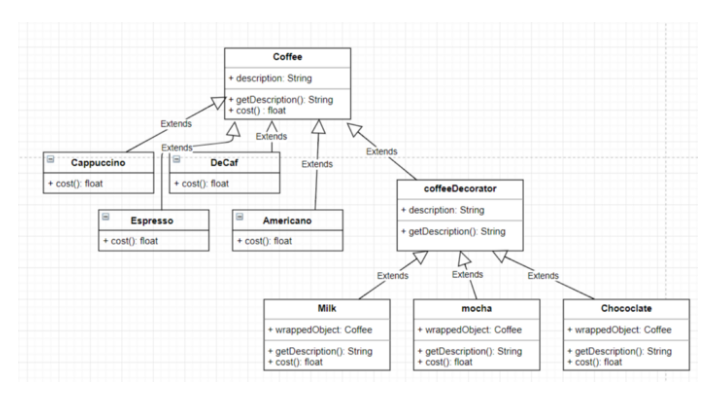

# DecoratorPattern

## Intent
Attach additional responsibilities to an object dynamically.

Decorators provide a flexible alternative to subclassing for extending functionality.

## Explanation

Implement a list menu with description and prices.

he open the current implementation of the menu and found this implementation:

So he added all the new options as a subclass under Coffee and SuperClass So the result is:

## the problems in this implementation:

this is an overcrowded and condenser implementation.

If you want to add a new category or new coffee type you will create its own Class and implement it.

What happens if the milk price will change?! you will change in all cost method in all coffee classes. (open for modification)

#The Core Implementation

- component can be used by each own or wrapped by a decoration.
- ConcreteComponent: it is the subclass that can be decorated by any decoration item.
- Decorator implements same interface or abstract class as the component it is going to decorate.
- each decorator HAS-A (wraps) a component, which means that the decorator hold a reference variable of the component is going to decorate it.
- note: the wrappedObject: coffee in each subClass Of the decorator just for simplification the implementation in the code below

#Our coffee-shop implementation

we met the SOLID Principles by this implementation into:

- we didn't modify the coffee parent class.
- it is simple to add new decorator like (soy) or add a new type of coffee by extending the parents classes and without modifying them, so it is open for extension, but closed for modification.
